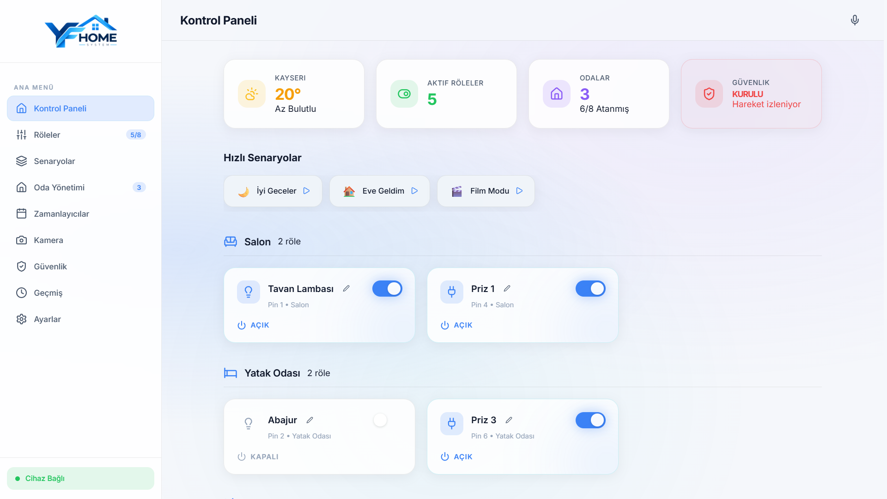
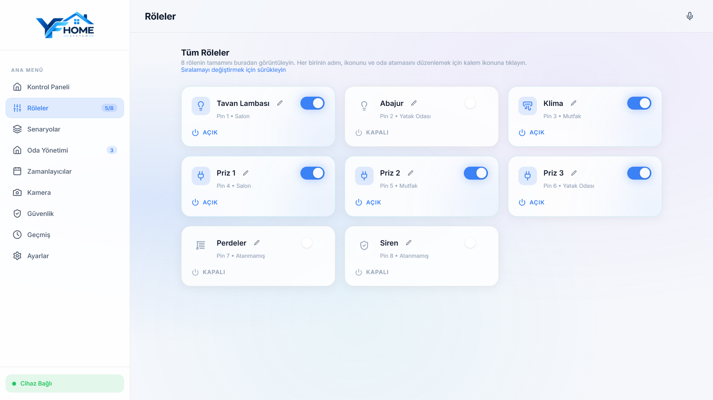
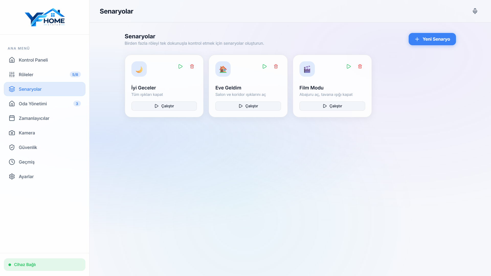
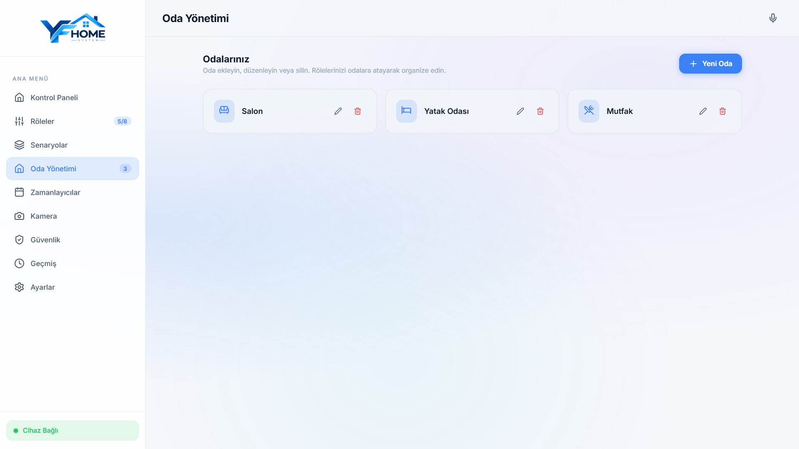
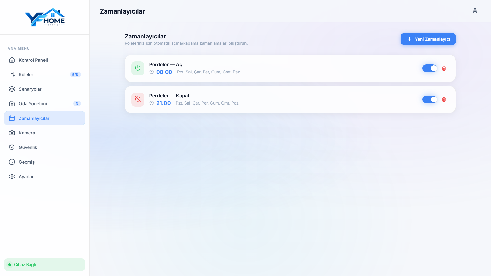

# YF Home System - Akıllı Ev Kontrol

**Modern, hızlı ve güvenli web tabanlı akıllı ev otomasyon & güvenlik yönetim platformu.**

 

> ⚠️ **Fikri Mülkiyet Bildirimi:** Bu depo, projenin mimarisini, yeteneklerini ve arayüz tasarımını sergilemek amacıyla hazırlanmış bir **vitrin (showcase)** reposudur. Çekirdek kaynak kodları ticari ve telif hakları sebebiyle kapalı kaynak olarak tutulmaktadır.

---

## 📌 Proje Genel Bakış

**YF Home System**, yerel ağda çalışan endüstriyel Ethernet röle kartları, IP kamera sistemleri ve çevre birimlerini merkezi bir noktadan yönetmek üzere tasarlanmış yeni nesil bir akıllı ev yönetim merkezidir. 

Bulut bağımlılığını en aza indiren yerel ağ mimarisi (Local-First), milisaniye seviyesinde röle tetikleme hızı, tarayıcı tabanlı görüntü işleme ile hareket algılama ve Türkçe sesli komut sistemi ile donatılmıştır.

---

## 📸 Ekran Görüntüleri & Önizleme

  <!-- Ekran görüntülerinizi 'screenshots/' klasörüne ekleyip yolları güncelleyebilirsiniz -->
  

 

  <table>
    <tr>
      <td width="50%">
        
        
<b>Röle Durumları</b>

      </td>
      <td width="50%">
        
        
<b>Özelleştirilebilir Senaryolar</b>

      </td>
    </tr>
    <tr>
      <td width="50%">
        
        
<b>Özelleştirilebilir Odalar</b>

      </td>
      <td width="50%">
        
        
<b>Zamanlayıcı ile Rutine Göre Çalışma</b>

      </td>
    </tr>
  </table>

---

## ✨ Temel Özellikler

### ⚡ 1. Endüstriyel Ethernet Röle Yönetimi
- **Milisaniyelik Yanıt:** Yerel REST/HTTP protokolü üzerinden 8 kanallı endüstriyel röle kartları ile doğrudan haberleşme.
- **Sürükle & Bırak Düzenleme:** `@dnd-kit` entegrasyonu ile röle kartlarını isteğe göre yeniden sıralama ve gruplama.
- **Dinamik İkon & İsimlendirme:** Her röleye özel cihaz türü (Lamba, Klima, Priz, Vana, Kapı vb.) ve oda ataması.

### 🛡️ 2. Gelişmiş Güvenlik & Hareket Algılama
- **Tarayıcı Tabanlı Hareket Algılama:** IP kamera akışını HTML5 Canvas üzerinde frame-differencing (kare farkı) algoritması ile gerçek zamanlı analiz ederek hareket algılama.
- **Kural Tabanlı Otomasyon:** Hareket algılandığında anında siren çalma, belirli ışıkları açma veya acil durum protokolünü devreye sokma.
- **Web Audio Siren Simülatörü:** Harici hoparlör/cihaz gerektirmeden tarayıcı seviyesinde dinamik frekans modülasyonlu acil durum alarmı.

### 🎙️ 3. Doğal Dil & Sesli Asistan (Web Speech API)
- Türkçe ve İngilizce ses tanıma desteği.
- *"Salon lambasını aç"*, *"Film modunu başlat"*, *"Tüm ışıkları kapat"* gibi doğal komutları otomatik işleme ve yürütme.

### 🎭 4. Senaryo & Zamanlayıcı Motoru
- **Tek Dokunuş Senaryolar:** "İyi Geceler", "Evden Çıkış", "Film Modu" gibi çoklu röle komutlarını tek tıkla çalıştırma.
- **Gelişmiş Zamanlayıcı (Scheduler):** Belirli saat ve günlerde otomatik açılma/kapanma görevleri planlama.

### 📱 5. Progressive Web App (PWA) & Tasarım Sistemi
- **Modern Glassmorphism:** Karanlık/Aydınlık tema desteği ve 6 farklı dinamik vurgu rengi (Turkuaz, Zümrüt, Mor, Mavi vb.).
- **PWA Desteği:** iOS ve Android cihazlarda uygulama mağazasına ihtiyaç duymadan yerel uygulama gibi ana ekrana yüklenebilme ve tam ekran çalışma.
- **Canlı Telemetri & Hava Durumu:** Open-Meteo API entegrasyonu ile anlık yerel hava durumu ve bağlantı sağlığı göstergesi.

---

## 🛠️ Mimari ve Teknoloji Yığını

| Alan | Kullanılan Teknolojiler |
| :--- | :--- |
| **Frontend Çatısı** | React 19, Vite 8, JavaScript (ESNext) |
| **Stil & Arayüz** | Vanilla CSS (Özel Tasarım Sistemi, Glassmorphism, CSS Değişkenleri) |
| **İkon Seti** | Lucide React |
| **Sürükle-Bırak** | @dnd-kit/core, @dnd-kit/sortable |
| **Sensör & Medya** | Web Speech API, HTML5 Canvas API, Web Audio API |
| **Çevrimdışı & PWA**| vite-plugin-pwa, Service Worker, Web App Manifest |
| **Haberleşme** | Local HTTP REST Proxy, Open-Meteo Geocoding API |
| **Çoklu Dil (i18n)** | Dahili Context tabanlı TR / EN dil desteği |

---

## 🔒 Lisans ve Telif Hakkı (Copyright & License)

Bu projenin kaynak kodları, görsel tasarımları, arayüz bileşenleri ve entegrasyon algoritmaları **özel mülkiyete tabi (Proprietary)** olup tüm hakları saklıdır.

- Yazılı izin olmaksızın kodların kısmen veya tamamen kopyalanması, çoğaltılması, tersine mühendisliğe tabi tutulması veya ticari amaçla kullanılması yasaktır.
- İş birliği, lisanslama veya kurumsal çözümler için lütfen iletişime geçiniz.

---

## 📬 İletişim & Geliştirici

Projeyle ilgili sorularınız, iş birlikleri ve demo talepleri için:

- **Geliştirici:** [YF CODE]
- **E-Posta:** [yfcodetr@gmail.com]
- **LinkedIn:** [linkedin.com/in/m-yusuf-uzun)
- **Web:** [yfcode.dev)
